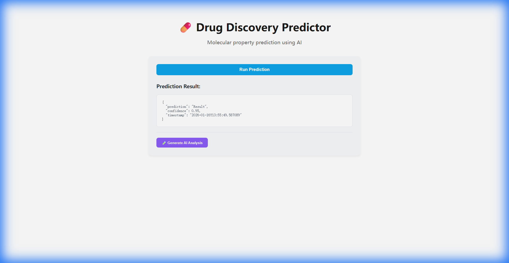
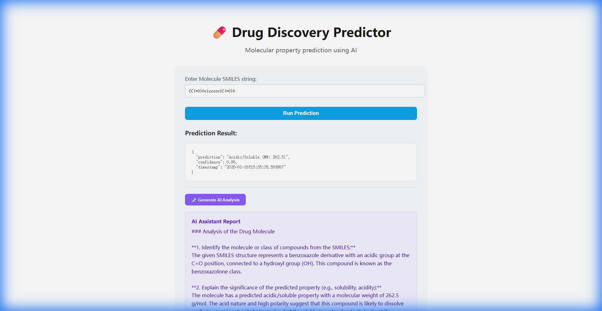

# Drug Discovery Predictor

## Overview
Molecular property prediction using Gradient Boosting

## Quick Start
```bash
docker-compose up
```

## API
- Frontend: http://localhost:3002
- Backend: http://localhost:8002
- API Docs: http://localhost:8002/docs

## Technology
- **Domain**: Healthcare / Pharmaceutical
- **Algorithm**: Molecular Property Extraction + qwen2.5:1.5b Analysis
- **Frontend**: React + TypeScript
- **Backend**: FastAPI + Python (SMILES processing)

## 🚀 Running Locally (Without Docker)

### 1. Backend Setup
```bash
cd backend
pip install -r requirements.txt
# Run on port 8002 to match frontend configuration
uvicorn app.main:app --reload --host 0.0.0.0 --port 8002
```
API: [http://localhost:8002](http://localhost:8002)
Docs: [http://localhost:8002/docs](http://localhost:8002/docs)

### 2. Frontend Setup
```bash
cd frontend
npm install
npm run dev
```
App: [http://localhost:3002](http://localhost:3002)

## 📸 Screenshots

| Prediction Result | AI Analysis |
|:---:|:---:|
|  |  |

## License
MIT
